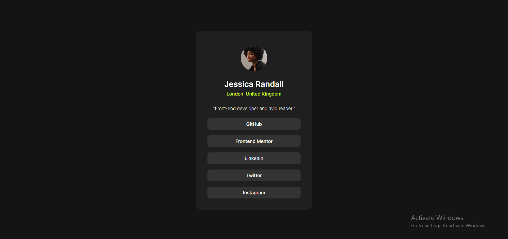

# Frontend Mentor - Social links profile solution

This is a solution to the [Social links profile challenge on Frontend Mentor](https://www.frontendmentor.io/challenges/social-links-profile-UG32l9m6dQ). Frontend Mentor challenges help you improve your coding skills by building realistic projects. 

## Table of contents

- [Overview](#overview)
  - [The challenge](#the-challenge)
  - [Screenshot](#screenshot)
  - [Links](#links)
- [My process](#my-process)
  - [Built with](#built-with)
  - [What I learned](#what-i-learned)
  - [Continued development](#continued-development)
- [Author](#author)

## Overview

This challenge was to make a digital profile card with different social links for a person. I just followed the basic model, but it can also be personalized in case I would want to use it for myself. It has interactive links that change when hovered over.

### The challenge

Users should be able to:

- See hover and focus states for all interactive elements on the page

### Screenshot

### Links

- Solution URL: [https://github.com/auntfunny/Social_Links_Profile](https://github.com/auntfunny/Social_Links_Profilem)
- Live Site URL: [social-links-profile-theta-six.vercel.app](social-links-profile-theta-six.vercel.app)

## My process

I built this app with Tailwindcss as one of my first tailwind projects. I first designed the HTML and then added the styles and decorations needed. After designing the card, I added a few features for responsiveness for mobile devices, using a mobile-first flow.

### Built with

- Semantic HTML5 markup
- Tailwind CSS
- Flexbox
- CSS Grid
- Mobile-first workflow

### What I learned

This project was not too difficult for me to design, but was helpful to practice and improve my abilities, especially using Tailwind. I learned many new options and ways to quickly incorporate Tailwind as I worked through this project.

### Continued development

I want to continue to practice with Tailwind, because I am not yet familiar with its workings, but I think with practice it can be much faster than using a CSS stylesheet to style a website.

## Author

- Website - [Anthony Black](https://auntfunny.github.io/Mini_Proyecto_1/)
- Frontend Mentor - [@auntfunny](https://www.frontendmentor.io/profile/auntfunny)
- Twitter - [@auntfunny](https://www.twitter.com/auntfunny)